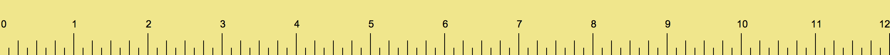

# Ruler - Desktop Screen Measuring Tool

A lightweight, cross-platform desktop application that displays a transparent ruler overlay on your screen for measuring pixels and distances.



## Features

- **Transparent Overlay**: Non-intrusive ruler displayed directly over your screen
- **Draggable Interface**: Click and drag to reposition the ruler anywhere
- **Cross-Platform**: Works on macOS, Windows, and Linux
- **Lightweight**: Minimal resource usage with a simple image-based design
- **Always-On-Top**: Frameless window stays on top for easy access

## Prerequisites

- **Node.js** 6.9.4 LTS or higher ([Download](https://nodejs.org/en/))
- **npm** (comes with Node.js)

## Installation

1. Clone this repository:
   ```bash
   git clone https://github.com/MuhammadShamim/ruler.git
   cd ruler
   ```

2. Install dependencies:
   ```bash
   npm install
   ```

## Running the Application

Start the application with:
```bash
npm start
```

The ruler will appear as a 1300×100 pixel transparent overlay on your screen.

## Building for Distribution

### macOS
```bash
npm install electron-packager -g
electron-packager . ruler --platform=darwin --arch=x64 --icon=images/ruler-icon.icns
```

### Windows
```bash
electron-packager . ruler --platform=win32 --arch=x64 --icon=images/ruler-icon.ico
```

### Linux
```bash
electron-packager . ruler --platform=linux --arch=x64 --icon=images/ruler-icon.png
```

## Project Structure

```
ruler/
├── main.js                 # Electron main process
├── index.html              # Application UI
├── package.json            # Project configuration
├── css/
│   └── ruler.css          # Application styles
├── images/
│   ├── ruler.png          # Main ruler display image
│   ├── ruler-icon.icns    # macOS application icon
│   ├── ruler-icon.ico     # Windows application icon
│   └── ruler-icon.png     # Linux application icon
└── README.md              # This file
```

## How It Works

- **main.js**: Electron main process that creates a transparent, frameless window with the dimensions 1300×100 pixels
- **index.html**: Simple HTML that displays the ruler image
- **ruler.css**: Styling to make the window draggable and display the ruler image properly
- **images/ruler.png**: High-quality ruler image (1200×80 px) rendered in the application

## Configuration

The window properties can be customized in [main.js](main.js):
- `width`: Window width in pixels (default: 1300)
- `height`: Window height in pixels (default: 100)
- `transparent`: Enable transparent background
- `frame`: Disable system frame for custom appearance

## Technology Stack

- **Framework**: Electron
- **Language**: JavaScript
- **Styling**: CSS3

## Author

Muhammad Shamim

## License

MIT License - see [LICENSE](LICENSE) file for details

## Future Enhancements

Potential improvements for future versions:
- Interactive pixel measurement tools
- Keyboard shortcuts for quick positioning
- Multiple ruler orientations (horizontal/vertical)
- Color picker integration
- Ruler mark interaction and annotations
- Window pinning and snapping features
